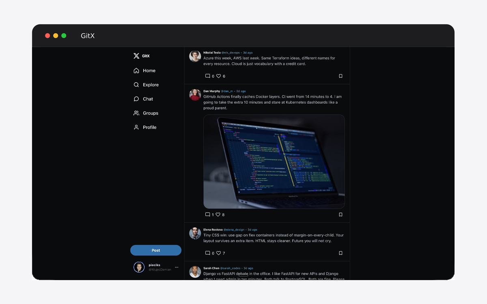
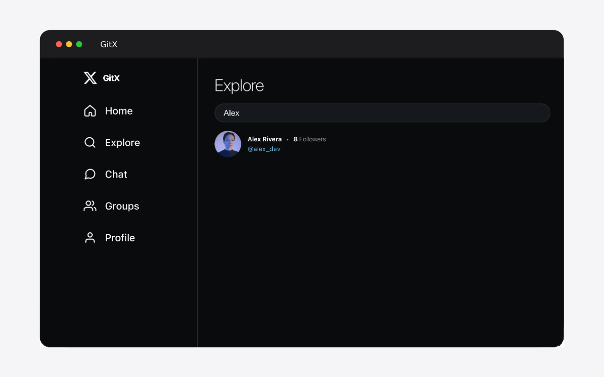
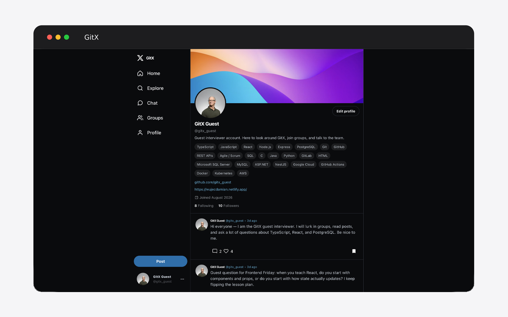
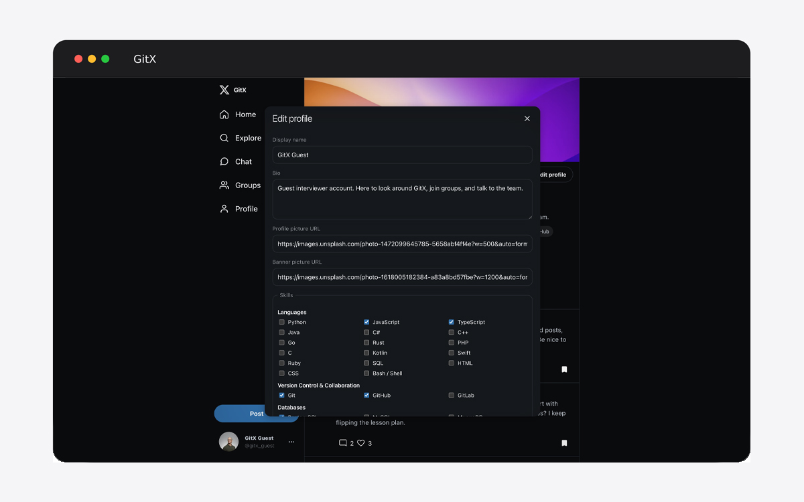
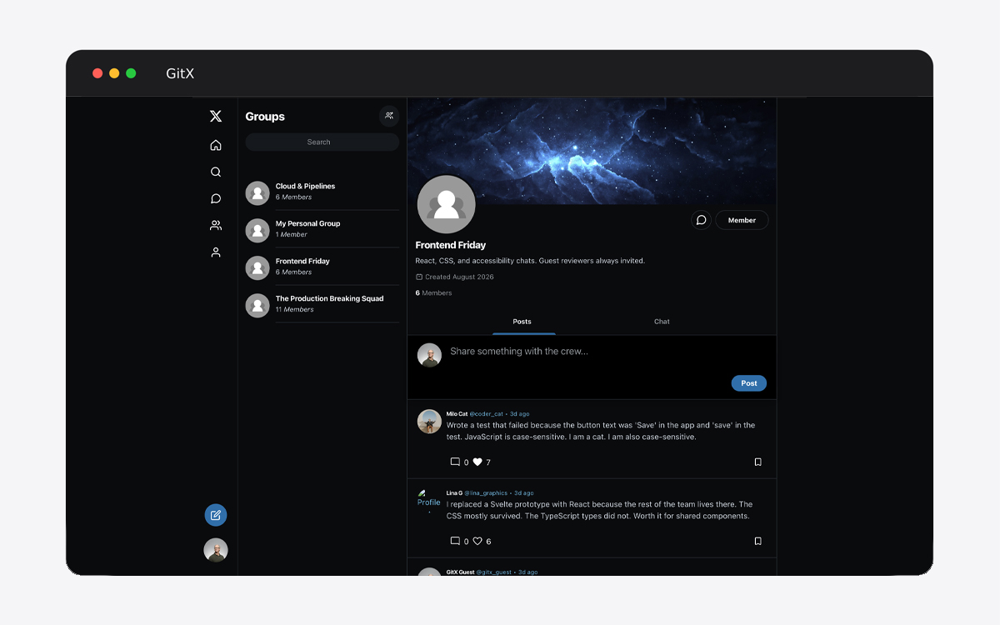
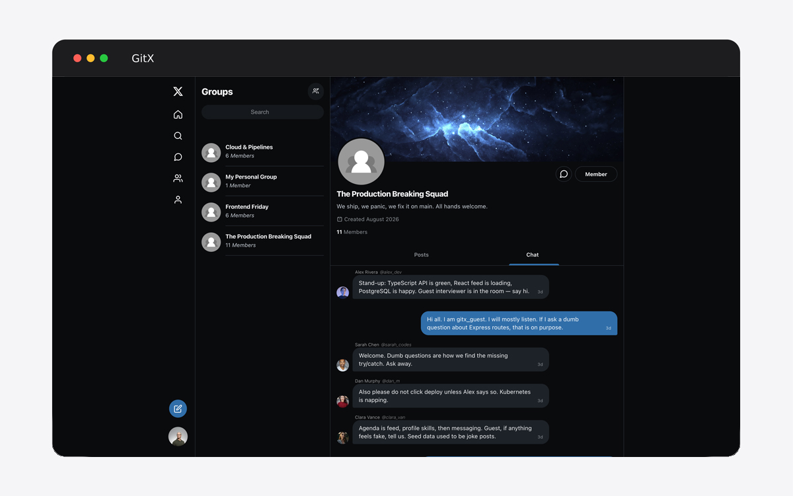

# GitX

GitX bridges the gap for developers and job seekers moving their digital identity between platforms. Instead of forcing recruiters and engineers to hop across disconnected sites, GitX consolidates your full professional footprint into a single, unified workspace.

#####
It's type of app that could be written by AI in minutes, but I wanted to actually learn so I used AI as little as possible (mainly for asking some trivial questions about prisma etc.)

## Live Demo

[View the live demo](https://gitx-wujec.netlify.app)

## Screenshots














## Tech Stack

### Frontend

- React
- TypeScript
- Vite
- React Router
- CSS

### Backend

- Node.js
- Express
- Socket.IO (currently in progress)
- Passport with GitHub login

### Other

- PostgreSQL
- Prisma
- Redis for sessions

## Features

- GitHub login
- Create and view posts
- Like, comment on, and bookmark posts
- Follow other users
- Explore users and posts
- Create and join groups
- Chat pages (real-time messaging is still in progress)
- User and group profiles

## How to Run It Locally

You will need Node.js, PostgreSQL, and Redis installed.

1. Clone the project and install the dependencies:

	```bash
	git clone git@github.com:WujecDamian/gitX.git
	cd gitX
	npm install
	```

2. Create a `.env` file in the project root. Add your PostgreSQL connection and GitHub OAuth values:

	```env
	DIRECT_URL="your-postgresql-connection-string"
	GITHUB_CLIENT_ID="your-github-client-id"
	GITHUB_CLIENT_SECRET="your-github-client-secret"
	GITHUB_CALLBACK_URL="http://localhost:3000/api/auth/github/callback"
	SESSION_SECRET="a-local-session-secret"
	FRONTEND_URL="http://localhost:5173"
	```

3. Start Redis in another terminal:

	```bash
	redis-server
	```

4. Create the database tables and generate the Prisma client:

	```bash
	npx prisma migrate dev
	npx prisma generate
	```

5. Add some test data to the database:

	```bash
	npx tsx prisma/seed.ts
	```

6. Start the frontend and backend together:

	```bash
	npm run dev
	```

7. Open `http://localhost:5173` in your browser.

## What I Learned / Challenges I Faced

Biggest challenge was getting sessions to work. The backend uses Redis to keep login sessions. Also of course designing database was hard to keep all relations working, thanks to Prisma ORM it was little bit easier because I haven't had to write raw SQL.
There was a lot of routers and controllers so also trying to connect frontend to backend was problematic, even though it was very repetitive process it was hard to remember everything just because of scale.
Also I had to implement debounce for more optimized searching, but I used mainly AI to do this so it would be good to learn more about this, because it's very important feature for bigger scale websites.

I am currently learning how to connect the Socket.IO server to the frontend correctly without breaking the normal API requests.

## Future Improvements

- Add better error messages and loading states
- Add Recruiter page where he can see and pick from prospects
- Make it more tailored for linkedin like site (now it's simple X copy)
- Add image uploading instead of only image URLs
- Finish real-time direct messages and group chats (socket.io)
- Add notifications for follows, likes, and messages
- Add tests
- Fix styling for light mode

Thanks for checking out GitX. This is a learning project, and I am still improving it as I learn more.